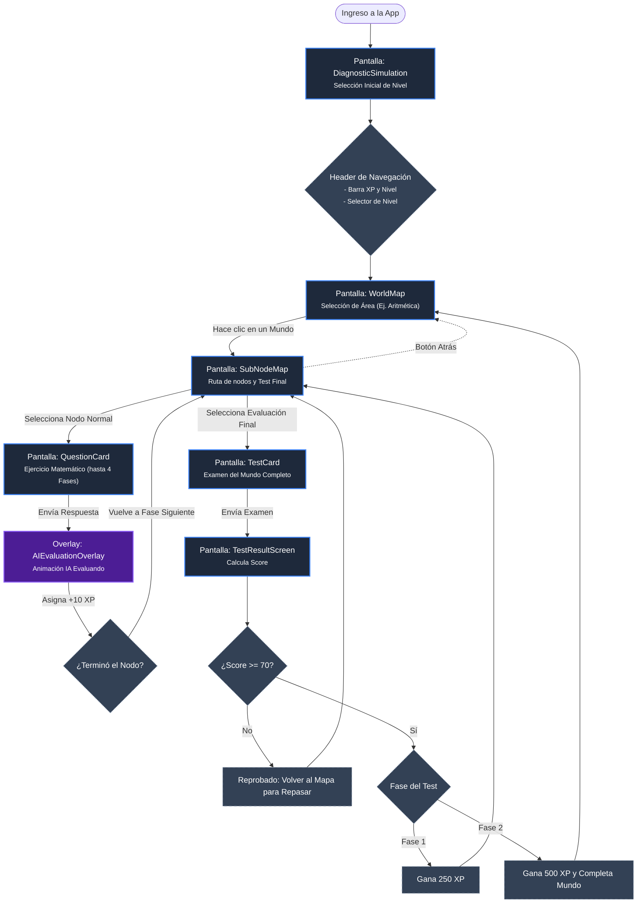

# User Flow: Recorrido de Aprendizaje en la Interfaz

Basado en el análisis de los componentes React (`App.jsx`, `WorldMap`, `SubNodeMap`, `QuestionCard`, `AIEvaluationOverlay`, etc.), este es el diagrama de flujo interactivo del usuario (User Flow) que mapea la navegación real entre las pantallas del prototipo.

### Detalle de Pantallas (Componentes):

1. **`DiagnosticSimulation.jsx`**: Es lo primero que ve el estudiante si no tiene nivel asignado. Hace unas preguntas rápidas o permite seleccionar el nivel directamente.
2. **Header (en `App.jsx`)**: Siempre visible. Mantiene al usuario informado sobre su progreso general (Nivel y XP) y le permite cambiar la dificultad de los ejercicios con el `ProficiencyDropdown`.
3. **`WorldMap.jsx`**: Visión global de los grandes bloques (ej. Aritmética, Álgebra). Al pasar la fase 2 del test de un mundo, este se marca como completado aquí.
4. **`SubNodeMap.jsx`**: El mapa detallado de un mundo específico. Muestra 10 nodos de aprendizaje y 1 nodo gigante de Test al final.
5. **`QuestionCard.jsx` & `AIEvaluationOverlay.jsx`**: El núcleo del aprendizaje interactivo. El estudiante responde, presiona enviar y salta el overlay de evaluación de la IA. Si acierta, sube la barra de progreso de ese nodo (tiene hasta 4 fases de preguntas).
6. **`TestCard.jsx` & `TestResultScreen.jsx`**: La prueba final. Tiene dos "Fases". Pasar la fase 1 da 250 XP. Pasar la fase 2 da 500 XP y te devuelve al `WorldMap` coronando ese mundo.
